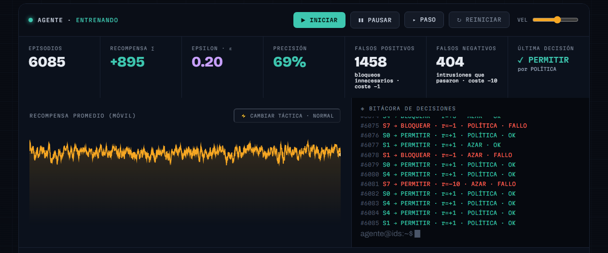
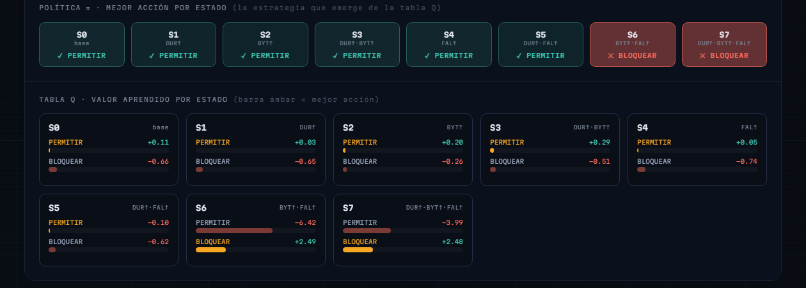

# Aprendizaje por Refuerzo para la Detección de Intrusiones en Redes Computacionales

**Asignatura:** Sistemas Inteligentes
**Modalidad:** Individual
**Autor:** Hector Alexis Becerra Alvarado
**Fecha:** 10/07/2026
**Repositorio:** https://github.com/HecthorBecerra/ProyectoSistemasInteligentes
**Aplicación web:** https://hecthorbecerra.github.io/ProyectoSistemasInteligentes/

---

## 1. Introducción

El Aprendizaje por Refuerzo (*Reinforcement Learning*, RL) es un paradigma
de la Inteligencia Artificial en el que un agente aprende a tomar
decisiones mediante la interacción directa con un entorno, en lugar de
a partir de ejemplos etiquetados. El agente prueba acciones, observa sus
consecuencias y ajusta su comportamiento según una señal de recompensa,
lo que lo hace especialmente adecuado para problemas de decisión
secuencial en contextos dinámicos e inciertos.

Este informe documenta el diseño e implementación de una aplicación web
interactiva que enseña los fundamentos del RL y los aplica a un caso
práctico de **detección de intrusiones en redes computacionales**: un
agente que, conexión por conexión, decide si el tráfico debe permitirse
o bloquearse, aprendiendo únicamente a partir de las recompensas que
recibe por sus decisiones.

## 2. Objetivos

- Explicar de forma clara los conceptos fundamentales del Aprendizaje
  por Refuerzo: agente, entorno, estado, acción, recompensa y política.
- Modelar un problema real y plausible de detección de anomalías —
  intrusiones en redes — en términos de estados, acciones y recompensas.
- Implementar un agente de Q-Learning capaz de aprender dicha política
  en tiempo real dentro del navegador.
- Ofrecer una visualización interactiva del proceso de aprendizaje que
  permita observar cómo evoluciona el comportamiento del agente.

## 3. Marco conceptual: Aprendizaje por Refuerzo

En RL, el agente y el entorno interactúan en un ciclo continuo: en cada
paso, el agente observa un **estado** del entorno, elige una **acción**
según su **política** (la estrategia que ha aprendido hasta ese
momento), y el entorno responde con un nuevo estado y una
**recompensa** numérica que indica qué tan buena fue esa decisión. El
objetivo del agente es aprender la política que maximiza la recompensa
acumulada a lo largo del tiempo.

Dos fuerzas compiten durante el aprendizaje: la **exploración** (probar
acciones nuevas para descubrir su efecto) y la **explotación** (usar el
conocimiento ya adquirido para actuar de la mejor forma conocida). Este
equilibrio se controla en la implementación con un parámetro
`epsilon`, que comienza alto (exploración casi total) y decae
gradualmente a medida que el agente acumula experiencia.

El algoritmo utilizado es **Q-Learning**, que mantiene una tabla de
valores `Q(estado, acción)` estimando qué tan conveniente es cada
acción en cada estado, y la actualiza tras cada decisión con la regla:

```
Q(s, a) ← Q(s, a) + α · [ r − Q(s, a) ]
```

donde `α` es la tasa de aprendizaje y `r` la recompensa recibida. Esta
es la forma de un solo paso de la regla general de Q-Learning: como en
este caso práctico cada conexión se evalúa de forma independiente, no
existe un estado siguiente que "bootstrapear" y el término de valor
futuro se omite.

## 4. Metodología: arquitectura de la solución

La aplicación es una página web sin backend, construida con HTML, CSS
y JavaScript (módulos ES nativos, sin paso de compilación), de forma
que sea sencilla de ejecutar, desplegar en GitHub Pages y modificar en
vivo. El código se organizó separando responsabilidades:

| Archivo | Responsabilidad |
| :--- | :--- |
| `js/entorno.js` | Reglas del caso práctico: cómo se generan las conexiones, cómo se codifican los estados y la matriz de recompensas. |
| `js/agente.js` | Agente de Q-Learning genérico (política epsilon-greedy, actualización de la tabla Q). No conoce el dominio del problema. |
| `js/simulacion.js` | Conecta agente y entorno episodio a episodio, y lleva las estadísticas de entrenamiento. |
| `js/visualizacion.js` | Actualiza la interfaz: tabla de valores Q, mapa de política, gráfico de recompensa (canvas 2D dibujado a mano, sin librerías externas) y bitácora de decisiones. |
| `js/juego-manual.js` | Mini-juego previo al entrenamiento: el usuario clasifica conexiones a mano usando solo `entorno.js`, sin depender del agente. |
| `js/formula-interactiva.js` | Laboratorio interactivo de la regla de actualización: el usuario manipula `α` y `r` y aplica pasos sobre un valor Q de juguete, visualizado en una recta numérica. |
| `js/main.js` | Conecta los controles de la interfaz (iniciar, pausar, reiniciar, velocidad, cambio de táctica) con el simulador. |

Esta separación permite modificar una parte del sistema —por ejemplo,
las reglas de recompensa o la velocidad de entrenamiento— sin afectar
el resto, lo que facilita el mantenimiento a lo largo del tiempo. 

## 5. Caso práctico: modelado del problema

Se seleccionó la **detección de intrusiones en redes computacionales**
como caso de aplicación. Cada conexión de red se resume en tres
características discretizadas, que en conjunto definen el **estado**
observado por el agente:

- **Duración** de la conexión: corta / larga.
- **Bytes transferidos**: pocos / muchos.
- **Intentos fallidos de autenticación**: bajo / alto.

La combinación de estas tres variables produce **8 estados posibles**.
En el entorno simulado, una conexión tiende a ser anómala cuando
combina *muchos bytes transferidos* con *muchos intentos fallidos de
autenticación* — un patrón asociado en la práctica a escaneos de
puertos o ataques de fuerza bruta — incorporando además un 10 % de
ruido aleatorio para que el patrón no sea trivial de aprender.

Las **acciones** disponibles para el agente son `permitir` o
`bloquear` la conexión. La **recompensa** se diseñó de forma
deliberadamente asimétrica, reflejando que en un sistema real de
detección de intrusiones no todos los errores tienen el mismo costo:

| Acción del agente | Conexión normal | Conexión anómala |
| :--- | :---: | :---: |
| Permitir | +1 (acierto) | −10 (falso negativo, grave) |
| Bloquear | −1 (falso positivo) | +3 (intrusión detectada) |

Dejar pasar una intrusión real (falso negativo) penaliza mucho más que
bloquear por error tráfico legítimo (falso positivo), empujando al
agente hacia una política más cautelosa frente a señales de riesgo —de
forma análoga a como se prioriza en un IDS real.

## 6. Resultados de la simulación

La aplicación permite ejecutar el entrenamiento en vivo y observar en
tiempo real la tabla de valores Q, el gráfico de recompensa promedio y
la bitácora de decisiones. Tras varios miles de episodios la política
converge, en la mayoría de los estados, hacia el comportamiento
esperado. Por ejemplo, para el estado más claramente anómalo —*bytes
muchos, intentos fallidos alto*— el agente aprendió `Q(bloquear) ≈
2.6` frente a `Q(permitir) ≈ −6.4`, es decir, identificó que bloquear
esa conexión es la acción correcta. De forma simétrica, para la
mayoría de los estados asociados a tráfico normal, el agente aprendió
a preferir `permitir`.

El gráfico de recompensa promedio muestra una curva ascendente desde
valores negativos (cuando el agente actúa casi al azar) hacia valores
estables y positivos a medida que la política mejora, lo que evidencia
visualmente el proceso de aprendizaje.

Además del entrenamiento en sí, la aplicación incorpora varios
elementos pensados para reforzar la comprensión del concepto, no solo
mostrarlo:

- **Laboratorio de la fórmula**: en la sección teórica, la regla de
  actualización no solo se muestra sino que se manipula. El usuario
  ajusta la tasa de aprendizaje `α` con un deslizador, elige una
  recompensa `r` de la matriz del caso práctico y aplica pasos uno a
  uno, viendo sobre una recta numérica cómo `Q` se desplaza hacia `r`
  una fracción `α` del error en cada paso. Esto hace tangible el
  compromiso central de `α` (velocidad vs. estabilidad) que resultó
  decisivo en la sección 6.1.
- **Exploración vs. explotación visibles**: cada decisión del agente se
  etiqueta en la bitácora como "azar" (exploración) o "política"
  (explotación), y un indicador muestra la naturaleza de la última
  decisión. Esto separa dos ideas que suelen confundirse: que una
  decisión sea *correcta* no es lo mismo que sea *aprendida*.
- **Mapa de política**: sobre la tabla Q, una tira de 8 celdas —una por
  estado— se colorea según la mejor acción actual, con intensidad
  proporcional a la brecha entre los dos valores Q (la "confianza" del
  agente). Es la política π hecha visible: se la ve emerger, celda por
  celda, a medida que avanza el entrenamiento.
- **Modo manual comparativo**: antes de entrenar al agente, el usuario
  clasifica manualmente 10 conexiones y obtiene su propio puntaje.
  Cuando el agente acumula suficientes episodios, un marcador
  "humano vs. agente" compara la precisión de ambos (la del agente,
  medida sobre sus últimos 100 episodios) y emite un veredicto — una
  forma directa de mostrar que la política aprendida no es trivial de
  igualar a mano.
- **Métricas de detección**: el panel cuenta por separado los falsos
  positivos (bloqueos innecesarios) y los falsos negativos (intrusiones
  que pasaron), conectando la matriz de recompensa asimétrica con las
  métricas con las que se evalúa un IDS real.
- **Cambio de táctica del atacante**: un control permite invertir en
  vivo qué combinación de características se considera anómala,
  simulando que el atacante adapta su comportamiento. La recompensa
  promedio cae de inmediato y se recupera gradualmente mientras el
  agente reabre su exploración y re-aprende la nueva política,
  ilustrando el problema de la no estacionariedad en RL (ver
  limitaciones).


*Figura 1. Vista inicial de la aplicación web.*


*Figura 2. Consola de entrenamiento en ejecución (~6000 episodios):
recompensa acumulada positiva, precisión global en ascenso, contadores
de falsos positivos/negativos y bitácora de decisiones etiquetadas como
exploración ("azar") o explotación ("política").*


*Figura 3. Política aprendida: los seis estados de tráfico normal
prefieren `permitir` y los dos estados de riesgo (S6, S7) prefieren
`bloquear`. En S6, `Q(permitir) ≈ −6.4` frente a `Q(bloquear) ≈ +2.5`.*

### 6.1 Problema detectado durante las pruebas: la política se estancaba

Al dejar correr el entrenamiento por más de mil episodios (a máxima
velocidad, para observar el largo plazo) se detectó que la precisión
acumulada, tras subir a ~60 % en los primeros cientos de episodios,
**caía de forma sostenida hasta ~35 % y se quedaba ahí**. Al reproducir
el mismo experimento de forma aislada (fuera del navegador, ejecutando
`agente.js`/`simulacion.js` directamente con Node.js, 8 corridas
independientes de hasta 30 000 episodios) se confirmó que no era una
casualidad de una corrida ni un problema de que "faltara tiempo": con
los parámetros originales (`alpha = 0.15`, `epsilonMin = 0.05`) la
precisión se estabilizaba en 32-37 % de forma consistente y **no se
recuperaba nunca**, incluso a 30 000 episodios.

Inspeccionando la tabla Q final se encontró la causa: en los 6 estados
donde la acción correcta es `permitir` (recompensa esperada ≈ −0.1),
una muestra aislada del castigo poco frecuente pero severo de dejar
pasar una intrusión (−10, con 10 % de probabilidad) bastaba para que
`Q(permitir)` cayera muy por debajo de su valor real en un solo paso,
porque `alpha = 0.15` es una tasa de aprendizaje demasiado agresiva
para una recompensa con esa asimetría. Una vez que `epsilon` decaía a
su mínimo (`0.05`, hacia el episodio ~300), sólo un 2.5 % de las
visitas a ese estado volvían a probar `permitir` — insuficiente para
corregir el error — y el agente quedaba atrapado eligiendo `bloquear`
en esos 6 estados de forma prácticamente permanente. Es un caso
concreto del problema clásico de *epsilon-greedy* con una tasa de
aprendizaje constante: sin suficiente exploración sostenida, una
sobreestimación temprana producida por una recompensa de cola pesada
puede fijar una política subóptima de la que el agente ya no tiene
manera de escapar.

**Solución aplicada:** se redujo la tasa de aprendizaje (`alpha: 0.15
→ 0.02`) para que una sola muestra extrema no domine la estimación de
`Q`, y se aumentó el piso de exploración (`epsilonMin: 0.05 → 0.20`)
para que el agente siga revisando ocasionalmente sus decisiones incluso
después de "converger", pudiendo corregir errores de estimación. Con
estos valores, la precisión acumulada se estabiliza entre 60-72 % de
forma consistente (validado con 10 corridas independientes hasta 8000
episodios), resolviendo correctamente 7 de los 8 estados en la mayoría
de las corridas, en vez de solo 2 de 8. El costo es un aprendizaje
visualmente más lento (los valores de Q tardan más en desplazarse en la
tabla), que se consideró un compromiso aceptable frente a una política
que simplemente no converge.

## 7. Limitaciones

- El espacio de estados es pequeño y discreto (8 estados); una red real
  produce características continuas y de mucha mayor dimensionalidad,
  lo que en la práctica requeriría técnicas de aproximación de función
  (p. ej. Deep Q-Networks) en lugar de una tabla Q explícita.
- Cada conexión se trata como un episodio independiente de un solo
  paso, similar a un *contextual bandit*, sin modelar dependencias
  entre conexiones sucesivas de una misma sesión de ataque.
- La aplicación incluye un escenario simplificado de no estacionariedad
  (un botón que hace que el atacante "cambie de táctica" a mitad de
  entrenamiento), útil para mostrar que el agente puede quedar
  desactualizado y debe re-explorar. Sin embargo, el disparo es manual
  y el refuerzo de la exploración es un valor fijo; un sistema real
  necesitaría detectar el cambio de forma automática (por ejemplo,
  monitoreando la caída de la recompensa o la precisión) y ajustar su
  exploración en consecuencia.
- Los datos son sintéticos, generados con una regla conocida de
  antemano; un entorno real requeriría datos etiquetados o señales de
  retroalimentación indirectas (por ejemplo, alertas confirmadas por un
  analista).
- No se comparó el desempeño frente a otros algoritmos de RL (SARSA,
  DQN) ni frente a enfoques clásicos de clasificación supervisada.

## 8. Conclusiones

El proyecto demuestra, de forma simplificada pero funcional, cómo un
agente de Aprendizaje por Refuerzo puede aprender una política de
decisión para detección de anomalías sin reglas programadas
explícitamente, únicamente a partir de una función de recompensa bien
diseñada. La asimetría de costos entre falsos positivos y falsos
negativos resultó ser el elemento central del modelado: es lo que guía
al agente hacia un comportamiento prudente frente al riesgo, replicando
una prioridad real de los sistemas de detección de intrusiones. Como
recurso educativo, la aplicación permite observar en tiempo real la
transición del agente desde un comportamiento exploratorio y errático
hacia una política estable y correcta, haciendo tangible un concepto
que suele explicarse solo en términos abstractos.

## 9. Referencias

Sutton, R. S., & Barto, A. G. (2018). *Reinforcement learning: An
introduction* (2nd ed.). MIT Press.

Watkins, C. J. C. H., & Dayan, P. (1992). Q-learning. *Machine
Learning*, 8(3-4), 279–292. https://doi.org/10.1007/BF00992698

Nguyen, T. T., & Reddi, V. J. (2021). Deep reinforcement learning for
cyber security. *IEEE Transactions on Neural Networks and Learning
Systems*, 34(8), 3779–3795. https://doi.org/10.1109/TNNLS.2021.3121870
